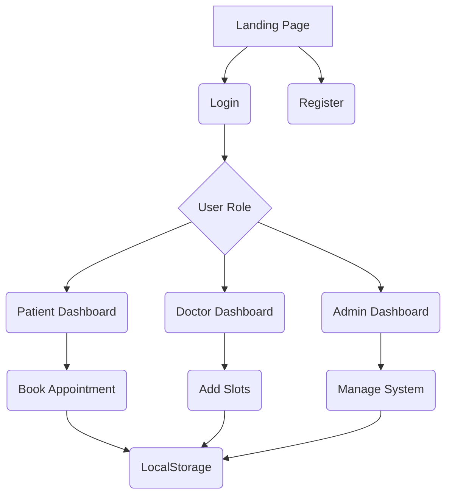

````markdown
<div align="center">

# 🏥 MediBook 3D
### Advanced Patient Appointment Management System


<p align="center">


</p>

### 🚀 Live Demo

## 🌐 https://defeated-aqua-mnu7c9xs.edgeone.dev/

</div>

---

# 🎥 Preview

> Replace these with your own screenshots/GIFs after uploading them.

| Landing Page | Patient Dashboard |
|--------------|------------------|
|  |  |

| Doctor Dashboard | Admin Dashboard |
|-----------------|----------------|
|  |  |

---

# 📖 About

**MediBook 3D** is a modern healthcare appointment management system featuring a premium 3D interface where:

- 👨‍⚕️ Doctors manage schedules
- 👤 Patients book appointments
- 🛠 Admin monitors the entire platform
- 📧 Mock email notifications are generated
- 💾 Data is stored using LocalStorage
- 📱 Fully responsive design

---

# ✨ Premium Features

## 👤 Patient

- ✅ Register
- ✅ Login
- ✅ Search Doctors
- ✅ Filter by Specialization
- ✅ Book Appointment
- ✅ Cancel Appointment
- ✅ Appointment History
- ✅ Responsive Dashboard

---

## 👨‍⚕️ Doctor

- Add Available Slots
- View Upcoming Patients
- Update Profile
- Change Specialization
- Manage Schedule
- Dashboard Analytics

---

## 🛠 Admin

- View Users
- Delete Users
- View Appointments
- Cancel Appointment
- Statistics Dashboard
- Manage Entire Platform

---

# 🚀 UI Highlights

- 🌈 Glassmorphism
- 🎨 Modern Gradient Design
- 📱 Responsive Layout
- ⚡ Fast Performance
- 💎 Premium Cards
- 🎯 Smooth Animations
- 🌙 Easy to Extend
- 🔥 Interactive Components

---

# 🛠 Tech Stack

| Frontend | Styling | Database | Icons |
|-----------|----------|----------|-------|
| HTML5 | Tailwind CSS | LocalStorage | Font Awesome |

---

# 📂 Folder Structure

```
MediBook-3D/
│
├── index.html
├── README.md
│
├── assets/
│   ├── screenshots/
│   ├── gifs/
│   └── images/
│
├── css/
│
├── js/
│
└── icons/
```

---

# 🏗 Architecture

```text
                    User
                      │
      ┌───────────────┼───────────────┐
      │               │               │
      ▼               ▼               ▼

 Patient         Doctor         Administrator

      │               │               │
      │               │               │
 Book Slot      Manage Slots     Monitor Users

      │               │               │
      └───────────────┼───────────────┘
                      ▼

             LocalStorage Database

                      │

                      ▼

             Dynamic Dashboard UI
```

---

# 🔄 Application Workflow



---

# 📸 Screenshots

## 🏠 Landing Page

```
assets/screenshots/home.png
```

---

## 👤 Patient Dashboard

```
assets/screenshots/patient-dashboard.png
```

---

## 👨‍⚕️ Doctor Dashboard

```
assets/screenshots/doctor-dashboard.png
```

---

## 🛠 Admin Dashboard

```
assets/screenshots/admin-dashboard.png
```

---

# 🎯 Demo Credentials

## Admin

```
Email:
admin@medibook.com

Password:
password123
```

---

## Doctor

```
Email:
dr.smith@medibook.com

Password:
password123
```

---

## Patient

```
Email:
john@demo.com

Password:
password123
```

---

# ⚙ Installation

## Clone Repository

```bash
git clone https://github.com/yourusername/medibook-3d.git
```

---

## Open Project

```
cd medibook-3d
```

Open

```
index.html
```

inside your browser.

---

# 🚀 Deployment

## GitHub Pages

```
Settings

↓

Pages

↓

Deploy from Branch

↓

main

↓

Save
```

---

## Netlify

```
New Site

↓

Drag & Drop Folder

↓

Deploy
```

---

## Vercel

```bash
npm i -g vercel

vercel
```

---

## EdgeOne Pages

Upload project folder

↓

Deploy

↓

Done ✅

---

# 🌟 Future Improvements

- Firebase Authentication
- MongoDB Integration
- Real Email Service
- SMS Reminder
- Online Payment
- Google Calendar Sync
- Doctor Ratings
- Chat Support
- AI Health Assistant
- Prescription Upload
- Medical Reports
- Dark Mode

---

# 📊 Project Stats

✔ Authentication

✔ CRUD Operations

✔ Responsive Design

✔ LocalStorage Database

✔ Search System

✔ Appointment Booking

✔ Dashboard

✔ Admin Panel

✔ Doctor Panel

✔ Patient Panel

---

# 🤝 Contributing

```bash
Fork

↓

Create Branch

↓

Commit

↓

Push

↓

Pull Request
```

---

# 📜 License

MIT License

---

# 👨‍💻 Developer

**Spandan Parhi**

GitHub

```
https://github.com/yourusername
```

LinkedIn

```
https://linkedin.com/in/yourprofile
```

---

<div align="center">

### ⭐ If you like this project, give it a Star ⭐

Made with ❤️ using HTML, Tailwind CSS & JavaScript

</div>
````
